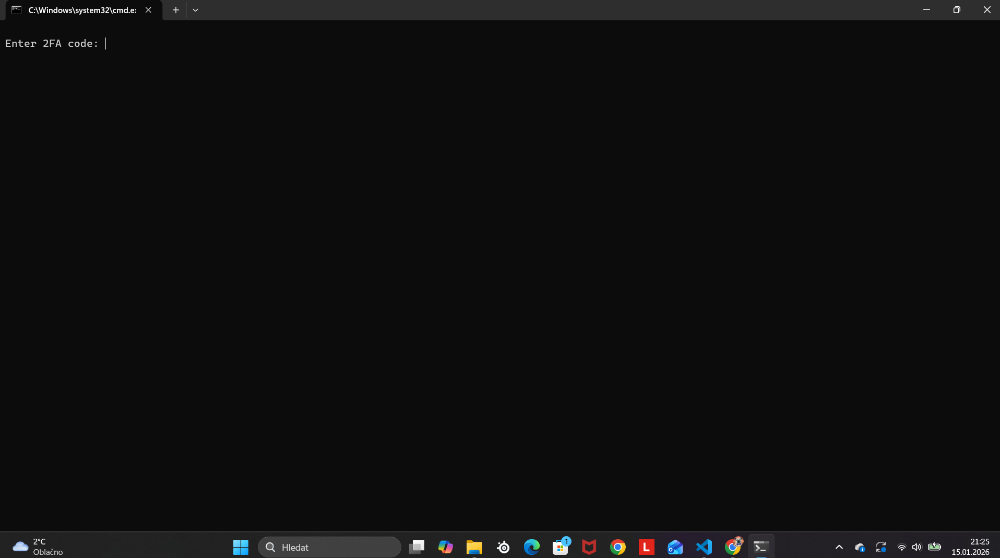

# Sigmis

**Sigmis** is an open-source **educational security simulation tool** written as a Windows batch script.

The project is designed for **learning purposes only**, demonstrating concepts such as:
- access control simulation
- integrity checks
- basic command-line security flows

Some advanced features are intentionally restricted and require a **whitelist key**.  
This is part of the simulation and **does not perform any real hacking or exploitation**.

---

## ⚠️ Disclaimer
Sigmis is **NOT malware** 
the 2fa key is 123 
you can check the source code 

This project is intended for:
- education
- scripting practice
- understanding basic security logic
- 

---

## 🚀 Features
- Simulated access verification
- Command-line menu system
- Windows MessageBox alerts
- Educational security flow design

---

## 📦 Requirements
- Windows OS
- Command Prompt (CMD)
## previw

---

